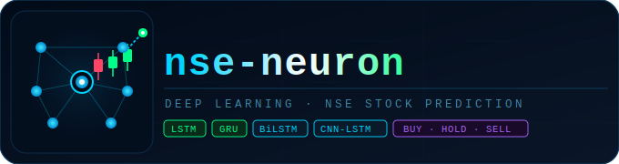
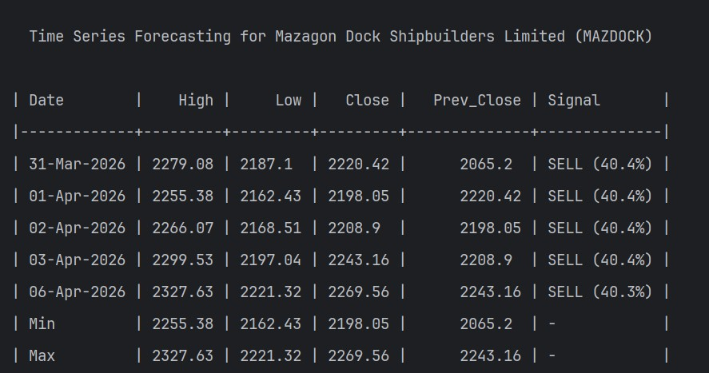
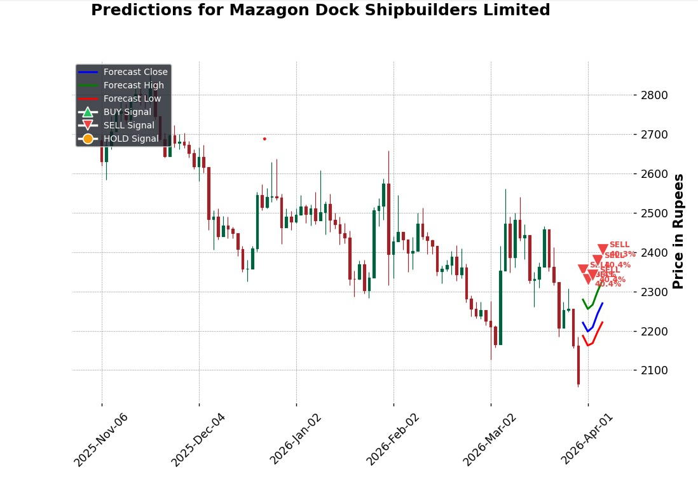
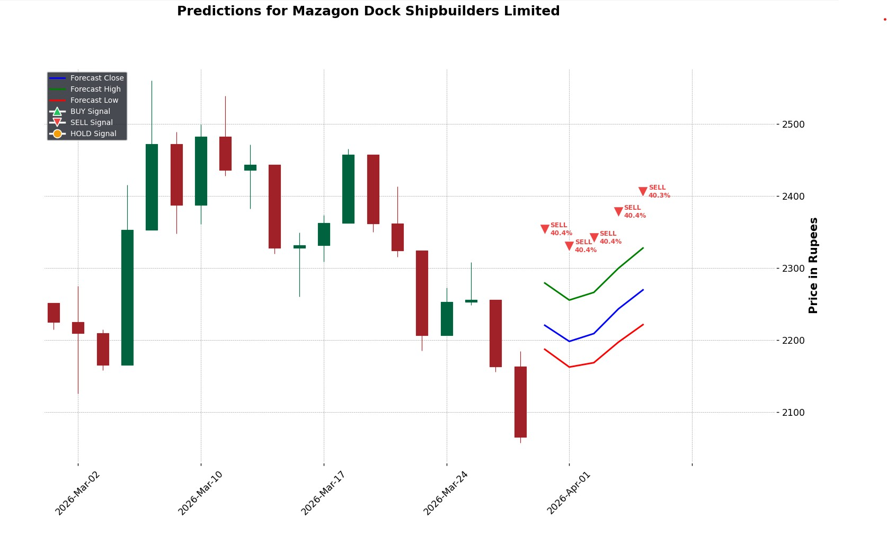

<div align="center">
  
  <h1>NSE-Neuron</h1>
  <p><strong>Deep Learning powered Stock Price Forecasting for National Stock Exchange of India</strong></p>

  
  
  
</div>

---

## 📌 Overview

**NSE-Neuron** is a command-line application that fetches historical stock data from the **NSE (National Stock Exchange of India)** and uses state-of-the-art deep learning models to forecast the next **5 trading days** of stock prices — including **High**, **Low**, **Close**, and **Previous Close** values.

When **LSTM** is selected, an additional **LSTM Classifier** automatically runs in the background to provide **BUY / HOLD / SELL** signals with confidence percentages for each predicted day.

---

## 🎬 Demo Video
> Watch NSE-Neuron in action — walkthrough.


---

## 🖥️ Screenshots

### Command-line Forecast Output


### Candlestick + Forecast Plot


### Expanded Forecast View


---

## ✨ Features

- 📈 **Multi-column forecasting** — predicts High, Low, Close, and Prev Close simultaneously
- 🕯️ **Candlestick chart** with historical OHLC data and overlaid forecast line
- 🤖 **BUY / HOLD / SELL signals** via LSTM Classifier (auto-runs with LSTM option)
- 🗓️ **Future business dates** shown in forecast table (skips weekends automatically)
- 🔌 **4 algorithm choices** — LSTM, BiLSTM, GRU, CNN-LSTM
- 🏁 **Run All mode** — runs all 4 algorithms together, compares close price forecasts side-by-side and ranks them by RMSE benchmark

---

## 🧠 Models

| # | Algorithm | Class | Best For |
|---|-----------|-------|----------|
| 1 | **LSTM** + Classifier | `LSTMModel` | Baseline; includes BUY/SELL/HOLD signals |
| 2 | **Bidirectional LSTM** | `BiLSTMModel` | Captures both past & future context in window |
| 3 | **GRU** | `GRUModel` | Fast convergence; strong performer on **shorter history** datasets |
| 4 | **CNN-LSTM** | `CNNLSTMModel` | Best accuracy on **large datasets**; CNN extracts local patterns, LSTM captures long-range trends |

> ### 📊 How to pick the right model
>
> The best model depends on **how much historical data is available** for the symbol.
> Use **Run All (option 5)** to let the benchmark decide automatically.
>
> | Available History | Recommended Model | Why |
> |-------------------|-------------------|---|
> | **< 5 years**     | BiLSTM             | Bidirectional context adds value with larger sequence windows|
> | **5 – 15 years**  | GRU               | Lightweight design converges well on medium-sized sequences  |
> | **15+ years**     | CNN-LSTM          | Enough data for CNN to extract meaningful local patterns before LSTM learns trends |
>
> **Bottom line:** CNN-LSTM is the most powerful architecture, but it needs sufficient historical data (15+ years) to outperform simpler models. On smaller datasets, GRU or LSTM's lightweight design gives them the edge.

---

## 🚀 Getting Started

### 1. Clone the repository

```bash
git clone https://github.com/NayakwadiS/NSE-Neuron.git
cd NSE-Neuron
```

### 2. Create a virtual environment

```bash
python -m venv .venv
.venv\Scripts\activate        # Windows
source .venv/bin/activate     # Linux / macOS
```

### 3. Install dependencies

```bash
pip install -r requirements.txt
```

### 4. Run the application

```bash
python main.py
```

---

## 📋 Usage

**Step 1** — Enter a valid NSE stock symbol (e.g. `INFY`, `RELIANCE`, `PNB`, `TCS`)

```
Enter the NSE Share Symbol:- INFY

Select the algorithm for forecasting:
1. LSTM with Classifier
2. BiLSTM
3. GRU
4. CNN-LSTM
Selection: 1
```

**Step 2** — Select the forecasting algorithm

**Output** — A forecast table and an interactive candlestick + forecast plot are displayed:

```
  Time Series Forecasting for Infosys Limited (INFY)

| Date        |    High |     Low |   Close |   Prev_Close | Signal       |
|-------------+---------+---------+---------+--------------+--------------|
| 02-Apr-2026 | 1312.45 | 1287.32 | 1298.76 |      1285.00 | BUY (38.2%)  |
| 03-Apr-2026 | 1318.90 | 1291.55 | 1304.12 |      1298.76 | BUY (40.1%)  |
| ...         |   ...   |   ...   |   ...   |        ...   | ...          |
| Min         | ...     | ...     | ...     |        ...   | -            |
| Max         | ...     | ...     | ...     |        ...   | -            |
```

---

## 📦 Dependencies

| Library | Purpose |
|---------|---------|
| `tensorflow` | LSTM, BiLSTM, GRU, CNN-LSTM model training |
| `nselib` | Fetch historical NSE stock data |
| `pandas` / `numpy` | Data manipulation |
| `scikit-learn` | MinMaxScaler, RMSE metric |
| `mplfinance` | Candlestick chart plotting |
| `matplotlib` / `seaborn` | Forecast overlay plots |
| `tabulate` | Pretty-print forecast table in terminal |
| `statsmodels` | Statistical utilities |

---

## 📄 License

This project is licensed under the terms of the [LICENSE](LICENSE) file.

---

## ⚠️ Disclaimer

This project is built for **educational and research purposes only**. The stock price forecasts generated by NSE-Neuron are based on historical data and deep learning models, and should **not** be considered as financial or investment advice. Always consult a qualified financial advisor before making any investment decisions. The authors are not responsible for any financial losses incurred based on the predictions made by this tool.

---

<div align="center">
  Made with ❤️ for the Indian Stock Market
</div>
