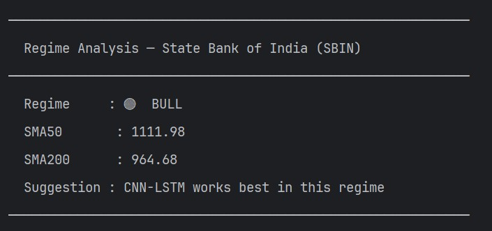

<div align="center">
  
  <h1>NSE-Neuron</h1>
  <p><strong>Deep Learning powered Stock Price Forecasting for National Stock Exchange of India</strong></p>

  
  
  
  [
](https://github.com/NayakwadiS/NSE-Neuron/stargazers)
</div>

---

## 📌 Overview

**NSE-Neuron** is a command-line application that fetches historical stock data from the **NSE (National Stock Exchange of India)** and uses state-of-the-art deep learning models to forecast the next **5 trading days** of stock prices — including **High**, **Low**, **Close**, and **Previous Close** values.

Each of the **4 forecasting models** automatically runs a dedicated **classifier** in the background to provide **BUY / HOLD / SELL** signals with confidence percentages for each predicted day. Use **Run All without Classifiers (option 5)** for a fast side-by-side benchmark across all models.

---

## 🎬 Demo Video
> Watch NSE-Neuron in action


---

## 🖥️ Screenshots

### Command-line Forecast Output


### Candlestick + Forecast Plot


### Expanded Forecast View


---

## ✨ Features

- 📈 **Multi-column forecasting** — predicts High, Low, Close, and Prev Close simultaneously
- 🕯️ **Candlestick chart** with historical OHLC data and overlaid forecast line
- 🤖 **BUY / HOLD / SELL signals** via dedicated classifier for **every algorithm** (LSTM, BiLSTM, GRU, CNN-LSTM)
- 🗓️ **Future business dates** shown in forecast table (skips weekends automatically)
- 🔌 **4 algorithm choices** — each with its own matching classifier architecture
- 🏁 **Run All without Classifiers (option 5)** — runs all 4 algorithms together, compares close price forecasts side-by-side and ranks them by RMSE benchmark
- 🔍 **Regime Analysis (option 6)** — detects market condition (BULL / BEAR / SIDEWAYS), recommends the best model, then lets you pick any algorithm with full classifier support

---

## 🧠 Models

| # | Algorithm | Classifier | Best For |
|---|-----------|------------|----------|
| 1 | **LSTM** | LSTM Classifier | Baseline; reliable on most datasets |
| 2 | **Bidirectional LSTM** | BiLSTM Classifier | Captures both past & future context in window |
| 3 | **GRU** | GRU Classifier | Fast convergence; strong performer on **shorter history** datasets |
| 4 | **CNN-LSTM** | CNN-LSTM Classifier | Best accuracy on **large datasets**; CNN extracts local patterns, LSTM captures long-range trends |

### 📊 How to pick the right model

The best model depends on **how much historical data is available** for the symbol.
Use **Run All (option 5)** to let the benchmark decide automatically.

| Available History | Recommended Model | Why |
|-------------------|-------------------|---|
| **< 5 years**     | BiLSTM             | Bidirectional context adds value with larger sequence windows|
| **5 – 15 years**  | GRU               | Lightweight design converges well on medium-sized sequences  |
| **15+ years**     | CNN-LSTM          | Enough data for CNN to extract meaningful local patterns before LSTM learns trends |

> **Bottom line:** CNN-LSTM is the most powerful architecture, but it needs sufficient historical data (15+ years) to outperform simpler models. On smaller datasets, GRU or LSTM's lightweight design gives them the edge.

---

## 📡 Regime Detection

Option **6 — Regime Analysis** detects the current market condition before you pick a model, so your choice is informed rather than guesswork.

### How it works

The detector uses a classic **SMA crossover** rule on the full historical close price:

| Condition | Regime | Recommended Model |
|-----------|--------|-------------------|
| SMA50 > SMA200 and Close > SMA200 | 🟢 **BULL** | CNN-LSTM |
| SMA50 < SMA200 and Close < SMA200 | 🔴 **BEAR** | BiLSTM |
| `\|Close − SMA200\| / SMA200 < 3%` or ambiguous cross | 🟡 **SIDEWAYS** | GRU |

> Minimum **1000 rows** of history required. If data is insufficient the system falls back to standard prediction without crashing.

### Signal confidence adjustment

When **Regime Analysis (option 6)** is selected, all 4 classifiers (LSTM, BiLSTM, GRU, CNN-LSTM) automatically adjust their BUY/SELL/HOLD confidence based on whether the signal agrees with the detected regime:

- **Regime confirms signal** → confidence boosted by `+8%`  *(e.g. BEAR regime + SELL signal)*
- **Regime conflicts signal** → confidence penalised by `−6%`  *(e.g. BEAR regime + BUY signal)*
- **SIDEWAYS** → no adjustment

> All 4 classifiers (LSTM, BiLSTM, GRU, CNN-LSTM) support regime-based confidence adjustment when selected inside Regime Analysis mode.

### Screenshot



---

## 🚀 Getting Started

### 1. Clone the repository

```bash
git clone https://github.com/NayakwadiS/NSE-Neuron.git
cd NSE-Neuron
```

### 2. Create a virtual environment

```bash
python -m venv .venv
.venv\Scripts\activate        # Windows
source .venv/bin/activate     # Linux / macOS
```

### 3. Install dependencies

```bash
pip install -r requirements.txt
```

### 4. Run the application

```bash
python main.py
```

---

## 📋 Usage

**Step 1** — Enter a valid NSE stock symbol (e.g. `INFY`, `RELIANCE`, `PNB`, `TCS`)

```
Enter the NSE Share Symbol:- INFY

Select the algorithm for forecasting:
1. LSTM
2. BiLSTM
3. GRU
4. CNN-LSTM
5. Run All without Classifiers
6. Regime Analysis (detect market regime, then choose model)
Selection: 1
```

**Step 2** — Select the forecasting algorithm. Options **1–4** each run their model **plus a matching classifier** automatically. Option **5** runs all models for a fast RMSE benchmark without classifiers. Option **6** detects the market regime first, then lets you choose.

**Output** — A forecast table and an interactive candlestick + forecast plot are displayed:

```
  Time Series Forecasting for Infosys Limited (INFY)

| Date        |    High |     Low |   Close |   Prev_Close | Signal       |
|-------------+---------+---------+---------+--------------+--------------|
| 02-Apr-2026 | 1312.45 | 1287.32 | 1298.76 |      1285.00 | BUY (38.2%)  |
| 03-Apr-2026 | 1318.90 | 1291.55 | 1304.12 |      1298.76 | BUY (40.1%)  |
| ...         |   ...   |   ...   |   ...   |        ...   | ...          |
| Min         | ...     | ...     | ...     |        ...   | -            |
| Max         | ...     | ...     | ...     |        ...   | -            |
```

**Run All (option 5)** produces a side-by-side comparison table and RMSE benchmark:

```
Close Price Forecast — Infosys Limited (INFY)

| Algorithm   |   Day 1       |   Day 2       |   Day 3       |   Day 4       |   Day 5       |
|             | 02-Apr-2026   | 03-Apr-2026   | 04-Apr-2026   | 07-Apr-2026   | 08-Apr-2026   |
|-------------+---------------+---------------+---------------+---------------+---------------|
| LSTM        |     1298.76   |     1304.12   |     1310.55   |     1315.30   |     1318.90   |
| BiLSTM      |     1290.44   |     1285.60   |     1278.32   |     1271.10   |     1263.80   |
| GRU         |     1295.88   |     1300.45   |     1305.20   |     1308.75   |     1312.30   |
| CNN-LSTM    |     1305.22   |     1308.90   |     1312.45   |     1315.00   |     1318.50   |

Model Benchmark — RMSE

| Algorithm   | RMSE      |
|-------------+-----------|
| LSTM        | 45.2310   |
| BiLSTM      | 38.7654   |
| GRU         | 32.1045   |
| CNN-LSTM    | 29.8732   |
| Best Model  | CNN-LSTM  |
```

---

## 📦 Dependencies

| Library | Purpose |
|---------|---------|
| `tensorflow` | LSTM, BiLSTM, GRU, CNN-LSTM model training |
| `nselib` | Fetch historical NSE stock data |
| `pandas` / `numpy` | Data manipulation |
| `scikit-learn` | MinMaxScaler, RMSE metric |
| `mplfinance` | Candlestick chart plotting |
| `matplotlib` / `seaborn` | Forecast overlay plots |
| `tabulate` | Pretty-print forecast table in terminal |
| `statsmodels` | Statistical utilities |

---

## 📄 License

This project is licensed under the terms of the [LICENSE](LICENSE) file.

---

## ⚠️ Disclaimer

This project is built for **educational and research purposes only**. The stock price forecasts generated by NSE-Neuron are based on historical data and deep learning models, and should **not** be considered as financial or investment advice. Always consult a qualified financial advisor before making any investment decisions. The authors are not responsible for any financial losses incurred based on the predictions made by this tool.

---

<div align="center">
  Made with ❤️ for the Indian Stock Market
</div>
