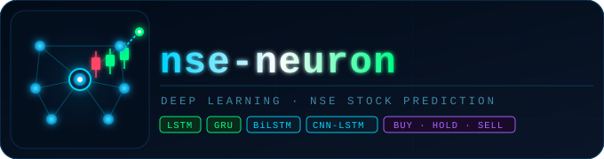
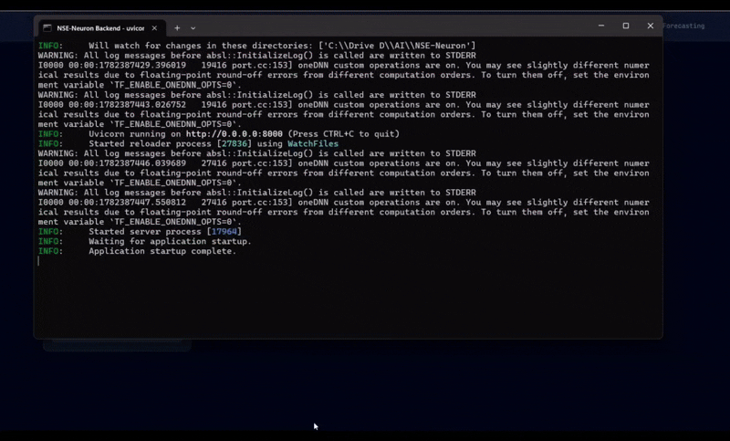
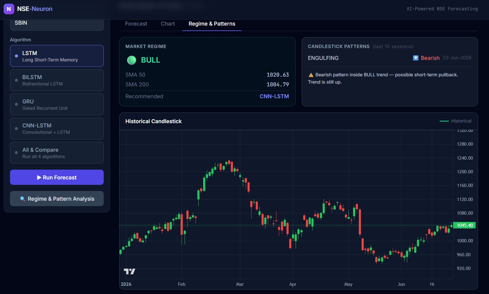
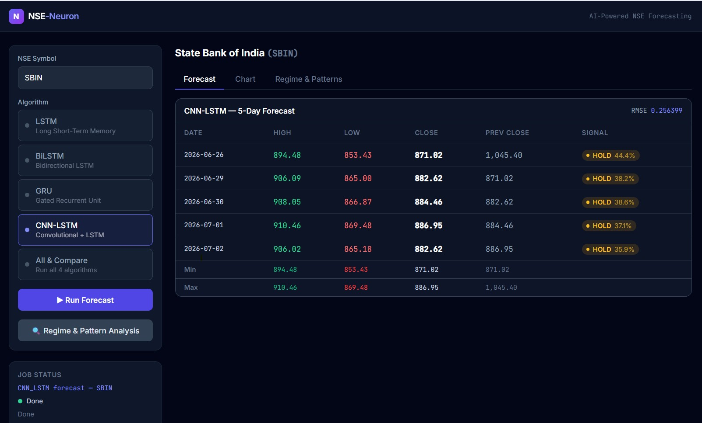
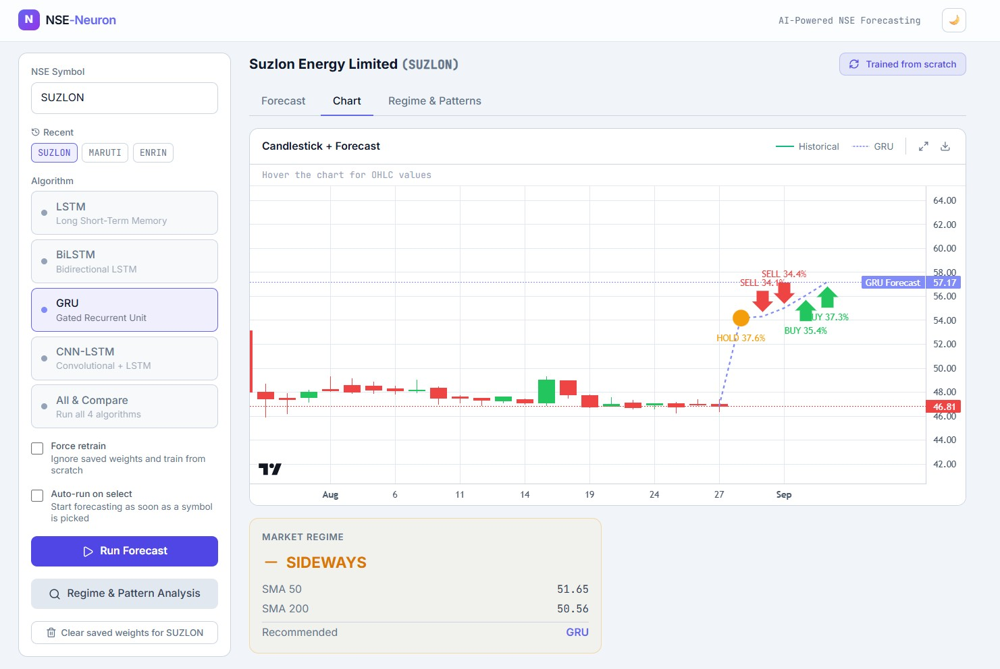

<div align="center">
  
  <h3>Deep Learning powered Stock Price Forecasting for NSE India</h3>

  
  
  
  
  [](https://github.com/NayakwadiS/NSE-Neuron/stargazers)
</div>

---



---

## What it does

NSE-Neuron fetches historical data for any NSE-listed stock and uses deep learning to forecast the next **5 trading days** — giving you predicted **High, Low, Close** prices along with **BUY / HOLD / SELL signals** and **market regime detection**.

Available as a **web UI** (one-click launch) and a **command-line tool**.

---

## Screenshots





---

## Highlights

- 🤖 **4 models** — LSTM · BiLSTM · GRU · CNN-LSTM, each with its own signal classifier
- 📊 **Run All mode** — trains all 4 models at once and ranks them by RMSE
- 🔍 **Regime detection** — identifies BULL / BEAR / SIDEWAYS market and recommends the best model
- 🕯️ **Candlestick patterns** — detects active patterns and cross-references them with the regime
- 📈 **Interactive chart** — zoomable OHLC chart with forecast overlay and signal markers

---

## Quick Start

```bash
# 1. Clone
git clone https://github.com/NayakwadiS/NSE-Neuron.git
cd NSE-Neuron

# 2. Python environment
python -m venv .venv
.venv\Scripts\activate          # Windows
source .venv/bin/activate       # macOS / Linux
pip install -r requirements.txt

# 3. Frontend
cd src/frontend && npm install && cd ../..
```

### Launch Web UI
```bat
start.bat          # Command Prompt
```
Open **http://localhost:5173** in your browser.

### Or use the CLI
```bash
python main.py
```

---

## License

Licensed under the terms of the [LICENSE](LICENSE) file.

> **Disclaimer** — For educational and research purposes only. Not financial advice. The authors are not responsible for any investment decisions made based on this tool.

---

> 🚀 Check out **[NSE-AI](https://github.com/NayakwadiS/NSE_AI_)** — an AI-Powered NSE Stock Analysis & reasoning engine built on top of this project.

<div align="center">Made with ❤️ for the Indian Stock Market</div>

