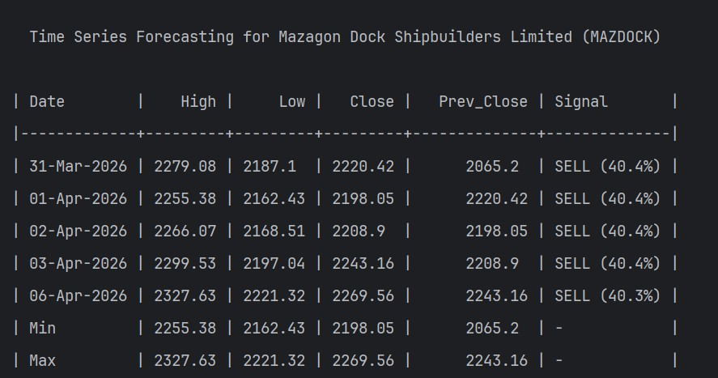
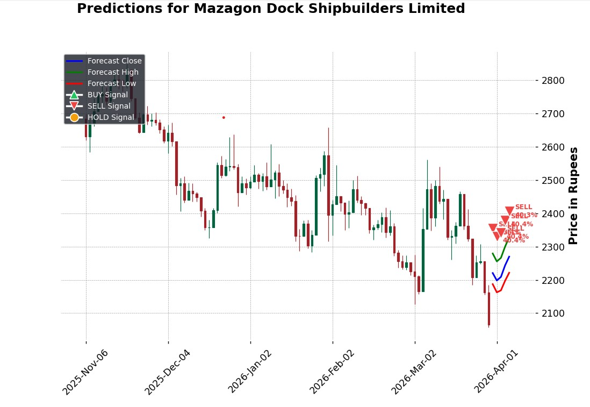
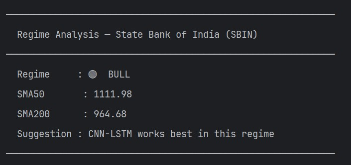

<div align="center">
  
  <h1>NSE-Neuron</h1>
  <p><strong>Deep Learning powered Stock Price Forecasting for National Stock Exchange of India</strong></p>

  
  
  
  
  
  [](https://github.com/NayakwadiS/NSE-Neuron/stargazers)
</div>

---

## 📌 Overview

**NSE-Neuron** is a deep learning stock price forecasting tool for the **NSE (National Stock Exchange of India)**.  
It now ships with **two interfaces** — a polished React web UI backed by a FastAPI server, and the original command-line interface.

Both interfaces share the same four forecasting models and produce **5-day predictions** of **High, Low, Close, and Previous Close** prices together with **BUY / HOLD / SELL signals** and **market regime analysis**.

---

## 🎬 Demo

### 🖥️ Web UI


### 💻 Command-line


---

## 🖼️ Screenshots

### Home Screen


### Forecast Results & Chart


### Regime & Pattern Analysis


### CLI Forecast Output


### Candlestick + Forecast Plot


---

## ✨ Features

### 🌐 Web UI (New)
- **One-click launch** — `start.ps1` / `start.bat` boots FastAPI backend + React frontend simultaneously
- **Symbol autocomplete** — debounced live search across the full NSE equity list
- **Interactive candlestick chart** — TradingView `lightweight-charts` with historical OHLC and forecast overlay
- **BUY / HOLD / SELL markers** directly on the chart with confidence percentages
- **Async job queue** — model training runs in a background thread; the UI polls for progress every 3 s
- **Regime & Pattern tab** — standalone market regime detection + candlestick pattern analysis with insight card
- **Dark trading-desk theme** — Tailwind CSS dark palette, fully responsive

### 💻 CLI (Original)
- 📈 **Multi-column forecasting** — predicts High, Low, Close and Prev Close simultaneously
- 🕯️ **Candlestick chart** with historical OHLC data and overlaid forecast line
- 🤖 **BUY / HOLD / SELL signals** via dedicated classifier for every algorithm
- 🗓️ **Future business dates** shown in forecast table (weekends skipped automatically)
- 🔌 **4 algorithm choices** — each with its own matching classifier architecture
- 🏁 **Run All (option 5)** — runs all 4 algorithms, compares close prices side-by-side and ranks by RMSE
- 🔍 **Regime Analysis (option 6)** — detects market condition, recommends the best model

---

## 🧠 Models

| # | Algorithm | Classifier | Best For |
|---|-----------|------------|----------|
| 1 | **LSTM** | LSTM Classifier | Baseline; reliable on most datasets |
| 2 | **Bidirectional LSTM** | BiLSTM Classifier | Captures both past & future context in the window |
| 3 | **GRU** | GRU Classifier | Fast convergence; strong on **shorter history** datasets |
| 4 | **CNN-LSTM** | CNN-LSTM Classifier | Best accuracy on **large datasets**; CNN extracts local patterns, LSTM captures long-range trends |

### 📊 How to pick the right model

| Available History | Recommended Model | Why |
|-------------------|-------------------|-----|
| **< 5 years**     | BiLSTM            | Bidirectional context adds value with larger sequence windows |
| **5 – 15 years**  | GRU               | Lightweight design converges well on medium-sized sequences |
| **15+ years**     | CNN-LSTM          | Enough data for CNN to extract meaningful local patterns before LSTM learns trends |

> **Bottom line:** CNN-LSTM is the most powerful architecture but needs 15+ years of data to outperform simpler models. On smaller datasets GRU or LSTM's lightweight design gives them the edge.

---

## 📡 Regime Detection

Regime Analysis detects the current market condition before you pick a model, so your choice is **data-driven** rather than guesswork.

| Condition | Regime | Recommended Model |
|-----------|--------|-------------------|
| SMA50 > SMA200 and Close > SMA200 | 🟢 **BULL** | CNN-LSTM |
| SMA50 < SMA200 and Close < SMA200 | 🔴 **BEAR** | BiLSTM |
| `\|Close − SMA200\| / SMA200 < 3%` or ambiguous cross | 🟡 **SIDEWAYS** | GRU |

> Minimum **1000 rows** of history required. If data is insufficient the system falls back to standard prediction without crashing.

### Signal confidence adjustment

When Regime Analysis is active, all classifiers automatically adjust BUY/SELL/HOLD confidence:

- **Regime confirms signal** → confidence boosted by `+8%` *(e.g. BEAR regime + SELL)*
- **Regime conflicts signal** → confidence penalised by `−6%` *(e.g. BEAR regime + BUY)*
- **SIDEWAYS** → no adjustment



---

## 🚀 Getting Started

### 1. Clone the repository

```bash
git clone https://github.com/NayakwadiS/NSE-Neuron.git
cd NSE-Neuron
```

### 2. Create a Python virtual environment

```bash
python -m venv .venv
.venv\Scripts\activate        # Windows
source .venv/bin/activate     # Linux / macOS
```

### 3. Install Python dependencies

```bash
pip install -r requirements.txt
```

### 4. Install frontend dependencies

```bash
cd src/frontend
npm install
cd ../..
```

---

## ▶️ Running the Application

### 🌐 Web UI — one-click launch (recommended)

**Windows PowerShell:**
```powershell
.\start.ps1
```

**Windows Command Prompt:**
```bat
start.bat
```

This opens **two terminal windows** — one for the FastAPI backend (port **8000**) and one for the React frontend (port **5173**).  
Then open your browser at **http://localhost:5173**

> API documentation is auto-generated at **http://localhost:8000/docs**

---

### 💻 CLI — original command-line interface

```bash
python main.py
```

**Step 1** — Enter a valid NSE symbol (`INFY`, `RELIANCE`, `TCS`, `SBIN` …)

```
Enter the NSE Share Symbol:- INFY

Select the algorithm for forecasting:
1. LSTM
2. BiLSTM
3. GRU
4. CNN-LSTM
5. Run All without Classifiers
6. Regime Analysis (detect market regime, then choose model)
Selection: 1
```

**Step 2** — Select the forecasting algorithm.  
Options **1–4** each run their model **plus a matching classifier** automatically.  
Option **5** runs all models for a fast RMSE benchmark.  
Option **6** detects the market regime first, then lets you choose.

**Output** — Forecast table + interactive candlestick plot:

```
  Time Series Forecasting for Infosys Limited (INFY)

| Date        |    High |     Low |   Close |   Prev_Close | Signal       |
|-------------+---------+---------+---------+--------------+--------------|
| 02-Apr-2026 | 1312.45 | 1287.32 | 1298.76 |      1285.00 | BUY (38.2%)  |
| 03-Apr-2026 | 1318.90 | 1291.55 | 1304.12 |      1298.76 | BUY (40.1%)  |
| ...         |   ...   |   ...   |   ...   |        ...   | ...          |
| Min         | ...     | ...     | ...     |        ...   | -            |
| Max         | ...     | ...     | ...     |        ...   | -            |
```

**Run All (option 5):**

```
Close Price Forecast — Infosys Limited (INFY)

| Algorithm   |   Day 1       |   Day 2       |   Day 3       |   Day 4       |   Day 5       |
|-------------+---------------+---------------+---------------+---------------+---------------|
| LSTM        |     1298.76   |     1304.12   |     1310.55   |     1315.30   |     1318.90   |
| BiLSTM      |     1290.44   |     1285.60   |     1278.32   |     1271.10   |     1263.80   |
| GRU         |     1295.88   |     1300.45   |     1305.20   |     1308.75   |     1312.30   |
| CNN-LSTM    |     1305.22   |     1308.90   |     1312.45   |     1315.00   |     1318.50   |

Model Benchmark — RMSE

| Algorithm   | RMSE      |
|-------------+-----------|
| LSTM        | 45.2310   |
| BiLSTM      | 38.7654   |
| GRU         | 32.1045   |
| CNN-LSTM    | 29.8732   |
| Best Model  | CNN-LSTM  |
```

---

## 🗂️ Project Structure

```
NSE-Neuron/
├── main.py                  ← CLI entry point
├── config.py                ← Global config (FORECAST_DAYS, SMA params …)
├── start.ps1 / start.bat    ← One-click UI launcher
├── requirements.txt
│
├── models/                  ← Forecasting models (LSTM, BiLSTM, GRU, CNN-LSTM)
│   └── classifiers/         ← BUY/HOLD/SELL classifiers
│
├── utils/
│   ├── data_fetcher.py      ← NSE API fetch + CSV cache
│   ├── preprocessor.py      ← OHLC normalisation
│   ├── regime_detector.py   ← SMA crossover regime detection
│   └── pattern_detector.py  ← Candlestick pattern detection
│
├── src/
│   ├── backend/             ← FastAPI server (port 8000)
│   │   ├── main.py
│   │   ├── routers/
│   │   │   ├── forecast.py  ← POST /api/forecast, GET /api/jobs/{id}
│   │   │   ├── analysis.py  ← POST /api/regime/{symbol}
│   │   │   └── data.py      ← GET /api/symbols, /api/historical/{sym}
│   │   └── services/
│   │       ├── job_manager.py   ← Async background job queue
│   │       └── nse_service.py   ← Wraps all models/utils for REST API
│   │
│   └── frontend/            ← React + Vite + Tailwind (port 5173)
│       └── src/
│           ├── pages/Home.tsx
│           ├── components/  ← ForecastChart, RegimeCard, PatternList …
│           ├── hooks/useJob.ts   ← Job polling (3 s interval)
│           └── api/client.ts    ← Axios API client
│
├── data/raw/                ← Cached NSE CSV files
└── saved_models/            ← Persisted model weights
```

---

## 📦 Dependencies

### Python (backend + CLI)

| Library | Purpose |
|---------|---------|
| `tensorflow` | LSTM, BiLSTM, GRU, CNN-LSTM model training |
| `fastapi` + `uvicorn` | REST API server |
| `nselib` | Fetch historical NSE stock data |
| `pandas` / `numpy` | Data manipulation |
| `scikit-learn` | MinMaxScaler, RMSE metric |
| `mplfinance` | Candlestick chart plotting (CLI) |
| `matplotlib` / `seaborn` | Forecast overlay plots (CLI) |
| `tabulate` | Pretty-print forecast table (CLI) |
| `statsmodels` | Statistical utilities |

### JavaScript (frontend)

| Package | Purpose |
|---------|---------|
| `react` + `vite` | UI framework + build tool |
| `tailwindcss` | Utility-first CSS |
| `lightweight-charts` | Interactive candlestick + forecast chart |
| `axios` | HTTP client for FastAPI |
| `react-hot-toast` | Toast notifications |

---

## 📄 License

This project is licensed under the terms of the [LICENSE](LICENSE) file.

---

## ⚠️ Disclaimer

This project is built for **educational and research purposes only**. The stock price forecasts generated by NSE-Neuron are based on historical data and deep learning models, and should **not** be considered as financial or investment advice. Always consult a qualified financial advisor before making any investment decisions. The authors are not responsible for any financial losses incurred based on the predictions made by this tool.

---

<div align="center">
  Made with ❤️ for the Indian Stock Market
</div>
